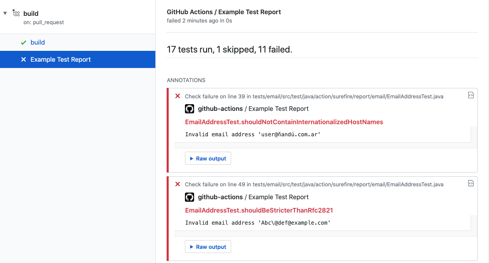

# GitHub Action: Process maven surefire reports


This action processes maven surefire or failsafe XML reports on pull requests and shows the result as a PR check with summary and annotations.



## Inputs

### `report_paths`

Optional. [Glob](https://github.com/actions/toolkit/tree/master/packages/glob) expression to surefire or failsafe report paths. The default is `**/surefire-reports/TEST-*.xml`.

### `create_check`

Optional. Set to `false` to add annotations to the current job where this action is being executed. The default is `true`.

### `check_name`

Optional. Check name to use when creating a check run. The default is `Test Report`.

### `commit`

Optional. The commit sha to update the status. This is useful when you run it with `workflow_run`.

### `fail_on_test_failures`

Optional. Check will fail if there are test failures. The default is `false`.

### `fail_if_no_tests`

Optional. Check will fail if no tests were found. The default is `true`.

### `ignore_flaky_tests`

Optional. Set to `true` to consider flaky tests as success. The default is `false`.

### `skip_publishing`

Optional. Skip the test report publishing (check run creation). The default is `false`.

### `github_token`

Optional. Usually in form of `github_token: ${{ secrets.GITHUB_TOKEN }}`. The default is `${{ github.token }}`.

### `file_name_in_stack_trace`

Optional. Set to `true` to get the file name from the stack trace. The default is `false`.

### `github_base_url`

Optional: If you use GitHub Enterprise, you can set this to the URL of your server (e.g. https://github.myorg.com/api/v3).


## Example usage

```yml
name: build
on:
  pull_request:

jobs:
  build:
    name: Build and Run Tests
    runs-on: ubuntu-latest
    # Permissions block is optional, useful for dependabot checks
    permissions:
      checks: write
      contents: read
    steps:
      - name: Checkout Code
        uses: actions/checkout@v4
      - name: Build and Run Tests
        run: mvn test --batch-mode --fail-at-end
      - name: Publish Test Report
        if: success() || failure()
        uses: scacap/action-surefire-report@v1
```

## Tips for Gradle

As Gradle uses a different build directory than Maven by default, you might need to set the `report_paths` variable:

```yaml
    report_paths: '**/build/test-results/test/TEST-*.xml'
```

You also need to enable JUnit XML reports as shown below.

```groovy
test {
  reports {
    junitXml.enabled = true
  }
}
```
